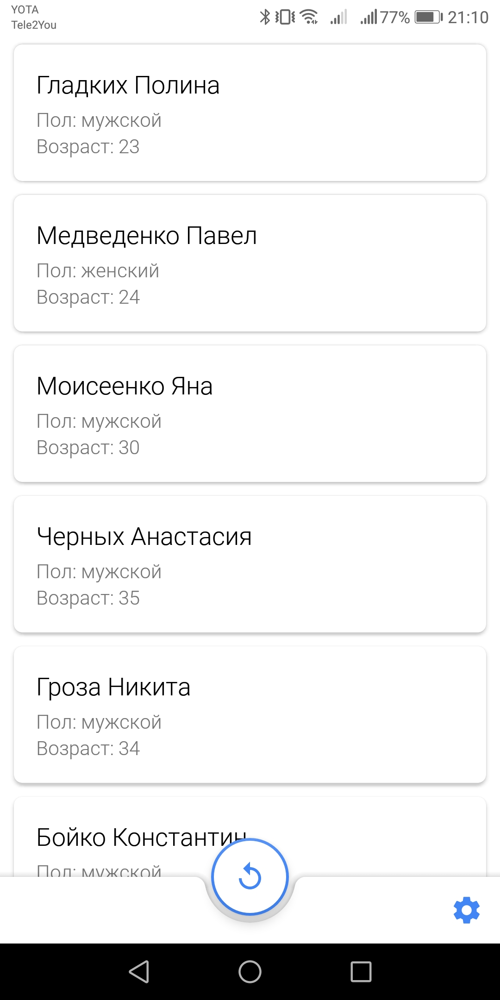

# Citizens for Android  

Приложение для получения и отображения сгенерированного списка граждан. 
Данный проект был реализован в качестве тестового задания.

### Содержание 

1. [Описание тестового задания](#paragraph1)
    * [Цель](#subparagraph1-1)
    * [Задача](#subparagraph1-2)
    * [Требования](#subparagraph1-3)
    * [Полное описание](#subparagraph1-4)
2. [Описание приложения](#paragraph2)
    * [Скриншоты](#subparagraph2-1)
3. [Контакты](#paragraph3)
    
## Описание тестового задания 

### Цель 

Данное тестовое задание призвано проверить знания и навыки по следующим направлениям:
* Внимательное чтение и изучение требований задания.
* Структурирование логики Android-приложения.
* Организация многопоточного и асинхронного взаимодействия компонентов
приложения.
* Гайдлайны Material Design и применение их для организации комфортного
взаимодействия пользователя с приложением.

***

### Задача 

Требуется разработать Android-приложение для просмотра информации о гражданах
выбранного города, сгенерированной случайным образом.
Приложение состоит из 2-х компонентов:
1. Генератор данных граждан.
2. UI (пользовательский интерфейс).

***

### Требования 

*Генератор данных граждан:*

* Генерация списка граждан должна происходить в потоке, отличном от потока
пользовательского интерфейса.
* Получение сгенерированного списка должно осуществляться с помощью службы
(Service).

*Пользовательский интерфейс:*

* Интерфейс должен быть удобным и понятным пользователю.
* При запросах пользовательского интерфейса к генератору на получение списка
пользовательский интерфейс не должен блокироваться.
* Пользовательский интерфейс, включая настройки генератора и список граждан
должен быть спроектирован в соответствии с Material Design.
* Вёрстка должна выполняться с использованием ConstraintLayout.
* Реализация списка выполняется с использованием RecyclerView.

*Общие:*

* Обязательные:
   * Проект должен быть выполнен в актуальной версии Android Studio.
   * Минимальная поддерживаемая версия Android: 6.0.
   * Запрещается использование сторонних библиотек (вроде RxJava).

* Дополнительные:
   * Применение паттерна Single Activity с использованием компонентов Fragment.
   * Применение паттерна MVVM.

***

### Полное описание 

С полным описанием тестового задания можно ознакомиться по данной [ссылке].

[ссылке]: https://drive.google.com/file/d/1GgAKOxKFG26vKMeAWZ4Lyar0gLhgETOC/view?usp=sharing

***

## Описание приложения 

### Скриншоты 

   
|  |  |  |
| :---------------------------------------------: | :---------------------------------------------: | :---------------------------------------------: |
| Список граждан                                  | Данные гражданина                               | Настройки                                       |
   

## Контакты 

[Вернуться к содержанию :arrow_up:](#paragraph0)
